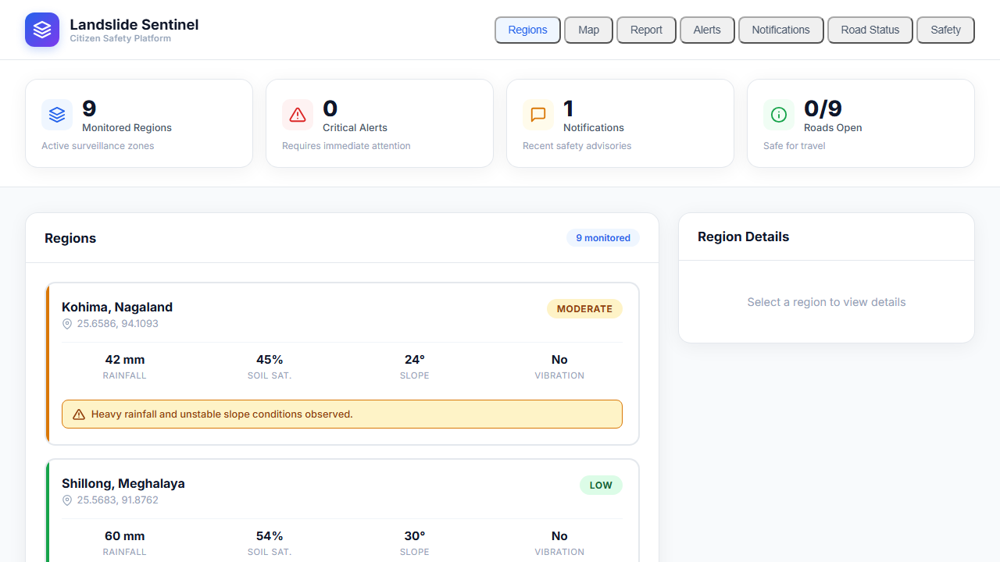
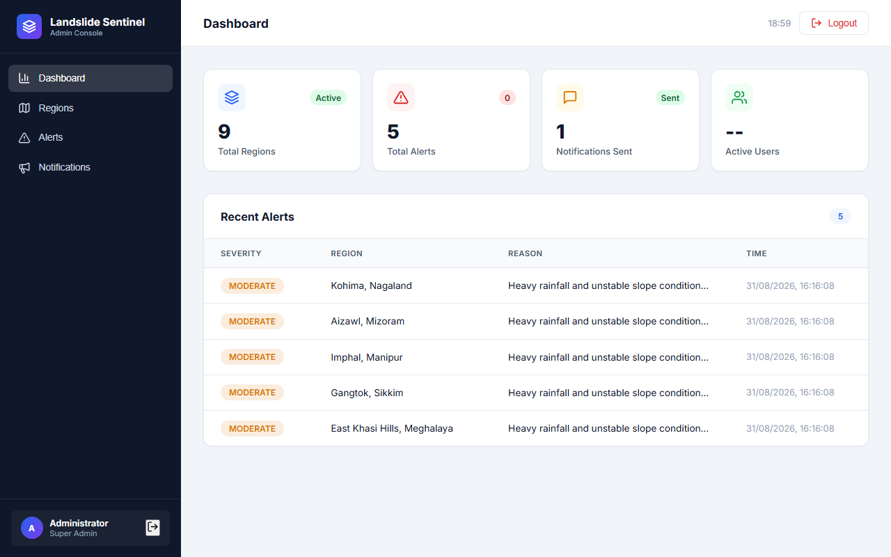

# NER Landslide Early Warning System

An offline-capable, multi-platform landslide monitoring and alerting system for the North-Eastern Region of India. The platform combines machine-learning risk assessment, citizen reporting, GIS views, official alert dispatch, and mobile mesh relay for low-connectivity environments.

## Product Screenshots

### Citizen Platform — Home & Regions


### Citizen Platform — GIS Map


### Citizen Platform — Alerts


### Citizen Platform — Submit Report



### Admin Dashboard


### Admin — Alert Management



### Admin — Notification Center


### Landslide Sentinel App Mark


## Demo Recordings

The repository includes recorded walkthroughs of the working interfaces:

- [Citizen platform demo](web-citizen/recordings/landslide-citizen-demo.webm)
- [Full citizen platform walkthrough](web-citizen/recordings/landslide-citizen-full-demo.webm)
- [Admin dashboard walkthrough](web-citizen/recordings/landslide-admin-full-demo.webm)
- [Additional recorded page demo](web-citizen/recordings/page%40f3d18f8af63809f63dbc252ee70f8148.webm)

GitHub may offer these `.webm` files as downloads rather than inline players. Download a recording and open it in a browser or VLC.

<video controls width="720" src="web-citizen/recordings/landslide-citizen-full-demo.webm"></video>

<video controls width="720" src="web-citizen/recordings/landslide-admin-full-demo.webm"></video>

## Report and Project Documentation

The complete project report describes the problem, solution architecture, data flow, ML risk engine, offline-first mobile workflow, mesh alert relay, deployment instructions, testing notes, monitored regions, and future enhancements. The recorded walkthroughs above show the citizen and admin screens in action.

- [Open the complete project report](PROJECT_REPORT.html)
- [Offline QA checklist](OFFLINE_QA_CHECKLIST.md)
- [Enhanced Smart India Hackathon presentation](SIH2026-IDEA-Presentation-Landslide-NER-ENHANCED.pptx)

### Report at a glance

| Area | Implementation |
| --- | --- |
| Risk assessment | Random Forest probability inference mapped to Low, Moderate, High, and Severe |
| Citizen access | React/Vite web portal and React Native mobile app |
| Administration | Region monitoring, alert creation, preview, and broadcast workflows |
| Resilience | SQLite cache, offline report queue, automatic sync, and peer-to-peer mesh relay |
| Situational awareness | GIS map, citizen reports, notifications, road status, and evacuation information |
| Backend | FastAPI REST API, SQLAlchemy models, SQLite persistence, and validation services |

## Platform Features

- Four-tier risk classification: Low, Moderate, High, and Severe
- FastAPI backend with SQLite persistence and REST endpoints
- Random Forest-based landslide probability inference with explainable decisions
- Citizen web portal for regions, alerts, notifications, road status, and reports
- Admin dashboard for region management and alert broadcasting
- React Native mobile app with local SQLite cache and queued offline reports
- Bluetooth/Wi-Fi mesh relay for forwarding cached alerts between nearby devices
- GIS maps with risk-coloured region markers and evacuation information

## Repository Layout

| Directory | Purpose |
| --- | --- |
| `backend/` | FastAPI API, database models, validation, alerting, and ML inference |
| `web-citizen/` | Citizen-facing React/Vite web application |
| `web-admin/` | Administrator React/Vite dashboard |
| `web/` | Additional React web interface |
| `mobile/` | Expo/React Native application and native Android mesh module |
| `PROJECT_REPORT.html` | Detailed technical project report |
| `web-citizen/recordings/` | Recorded product walkthroughs |

## Quick Start

### Backend

```powershell
cd backend
python -m venv .venv
.\.venv\Scripts\Activate.ps1
pip install -r requirements.txt
uvicorn app.main:app --reload --port 8000
```

The API is available at `http://localhost:8000` and interactive docs at `http://localhost:8000/docs`.

### Citizen Web App

```powershell
cd web-citizen
npm install
npm run dev -- --host 127.0.0.1 --port 5173
```

### Admin Web App

```powershell
cd web-admin
npm install
npm run dev -- --host 127.0.0.1 --port 5174
```

### Deploy both web apps to Vercel

Create two Vercel projects from this repository:

| Project | Vercel Root Directory | Build command | Output directory |
| --- | --- | --- | --- |
| Citizen portal | `web-citizen` | `npm run build` | `dist` |
| Admin dashboard | `web-admin` | `npm run build` | `dist` |

Set `VITE_API_URL` in each Vercel project to the deployed backend URL ending in `/api/v1`, for example `https://api.example.com/api/v1`. Do not use `localhost` in Vercel environment variables. Add the variable for Preview and Production, then redeploy after changing it.

The currently deployed Render API is `https://sih-landslide-yuc9.onrender.com/api/v1`. The web clients use it automatically for production builds when `VITE_API_URL` is not set. For a custom frontend hostname, set the backend Render environment variable `CORS_ORIGINS` to its exact comma-separated origin(s), for example `https://portal.example.org,https://admin.example.org`, then redeploy the API.

The backend must be deployed separately because Vercel is hosting the two static Vite frontends. Configure CORS on the backend to allow both Vercel domains.

### Mobile App

```powershell
cd mobile
npm install
npx expo start
```

For a debug Android APK, see [`mobile/BUILD_APK.md`](mobile/BUILD_APK.md).

## API and Configuration Notes

The web clients use Vite's dev-server proxy (`/api/v1` → `http://127.0.0.1:8000`) for local development. The mobile app connects to the backend at `http://10.229.128.155:8000/api/v1`; update `mobile/src/services/api.js` for a different host. Local databases, environment files, virtual environments, dependency folders, caches, and build output are excluded by `.gitignore`.

### Supabase ingestion storage

The backend can store live weather, sensor, alerts, and citizen-report ingestion records in Supabase PostgreSQL. Copy the Supabase database URI from **Supabase Dashboard → Connect → URI** into `backend/.env` as `DATABASE_URL`, using the `postgresql+psycopg2://` prefix. Install backend requirements and restart FastAPI; its schema setup creates the required tables automatically. Keep the URI only in `.env`—never in mobile/web code or source control.

## Technology Stack

Python, FastAPI, SQLAlchemy, SQLite, scikit-learn, React, Vite, Leaflet, React Native, Expo, Kotlin, Gradle, and Google Nearby Connections.

## Project Context

Built for Smart India Hackathon 2026 as a disaster-readiness solution focused on reliable warnings when internet infrastructure is intermittent or unavailable.
